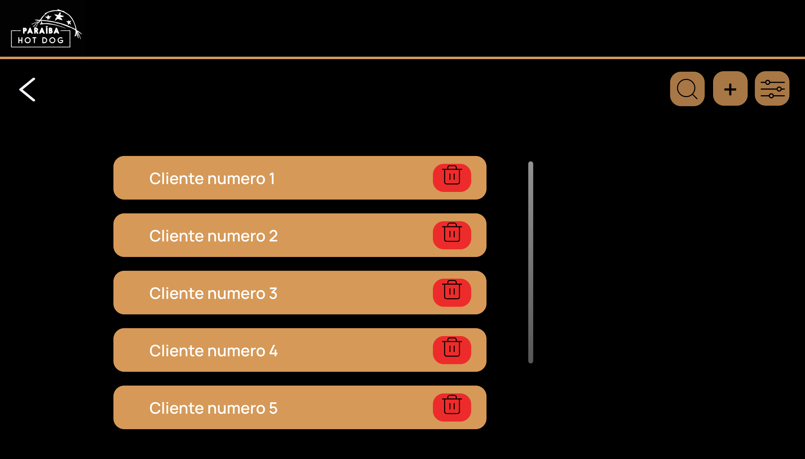
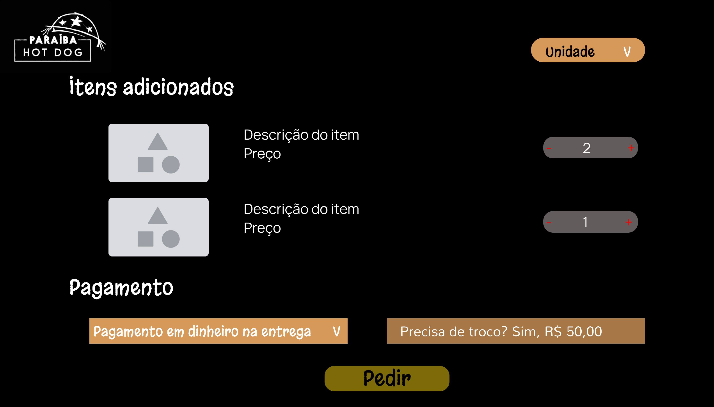

# Documentação do Protótipo para o Site "Paraíba Hotdog"

Este documento descreve o protótipo de interface do usuário que será implementado no site "Paraíba Hotdog". Cada imagem do protótipo representa uma funcionalidade ou página específica do site, detalhada abaixo.

---

## **Telas Gerais**

  .png)

---

## **1. Tela de Administração**
### Descrição:
- Esta tela é destinada ao administrador do sistema.
- Contém três botões principais:
  - **Clientes**: Exibe a lista de clientes cadastrados.
  - **Cardápio**: Permite gerenciar os itens do cardápio.
  - **Pedidos**: Exibe os pedidos realizados.

  .png)

---

## **2. Tela de Gerenciamento do Cardápio**
### Descrição:
- Lista os lanches disponíveis no cardápio.
- Permite ao administrador adicionar, editar ou excluir itens do cardápio.

---

## **3. Tela de Gerenciamento de Clientes**
### Descrição:
- Exibe a lista de clientes cadastrados com informações.
- Cada cliente possui um botão para visualizar detalhes ou editar informações.

---

## **4. Tela de Criação/Edição de Itens do Cardápio**
### Descrição:
- Formulário para adicionar ou editar itens no cardápio.
- Campos disponíveis:
  - **Título**: Nome do item.
  - **Descrição**: Detalhes sobre o item.
  - **Preço**: Valor do item.
  - **Adicionais**: Opções extras que podem ser incluídas no pedido.
- Botão "Criar" para salvar as alterações.

---

## **5. Tela de Cadastro de Clientes**
### Descrição:
- Formulário para cadastrar novos clientes no sistema.
- Campos disponíveis:
  - Nome, CPF, Contato, CEP, Cidade, Número e Complemento.
- Botão "Criar" para salvar o cadastro.
.png)
---

## **6. Tela Inicial (Home)**
### Descrição:
- Página inicial acessível a todos os usuários.
- Contém os seguintes botões:
  - **Menu**: Redireciona para o cardápio completo.
  - **Fidelidade**: Mostra informações sobre o programa de fidelidade.
  - **Sobre**: Exibe informações sobre a empresa.

---

## **7. Tela do Cardápio**
### Descrição:
- Exibe as categorias disponíveis no cardápio, como:
  - Tradicional, Promoções, Especial, Frango e Combo.
- Cada categoria contém os itens disponíveis com seus respectivos preços.
.png)
---

## **8. Tela de Carrinho e Pagamento**
### Descrição:
- Exibe os itens adicionados ao carrinho com suas descrições e quantidades ajustáveis (+/-).
- Mostra o valor total da compra e opções de pagamento.
- Botão "Pedir" para finalizar a compra.

---

## **9. Tela de Fidelidade**
### Descrição:
- Apresenta o programa de fidelidade da empresa.
- Mostra um indicador visual (ex.: ícones preenchidos) que acompanha o progresso dos clientes em relação às recompensas disponíveis.
- Lista os benefícios acumulados, como descontos ou brindes.
.png)
---

## Considerações Finais
Este protótipo foi projetado para oferecer uma experiência intuitiva tanto para os administradores quanto para os clientes. A implementação seguirá as diretrizes apresentadas neste documento para garantir funcionalidade e usabilidade alinhadas às necessidades da empresa "Paraíba Hotdog".
[Figma](https://www.figma.com/design/d56qztfj5Lj9qsH8ceZwBQ/Untitled?node-id=0-1&t=0BjbqymMbFYse6q9-1)